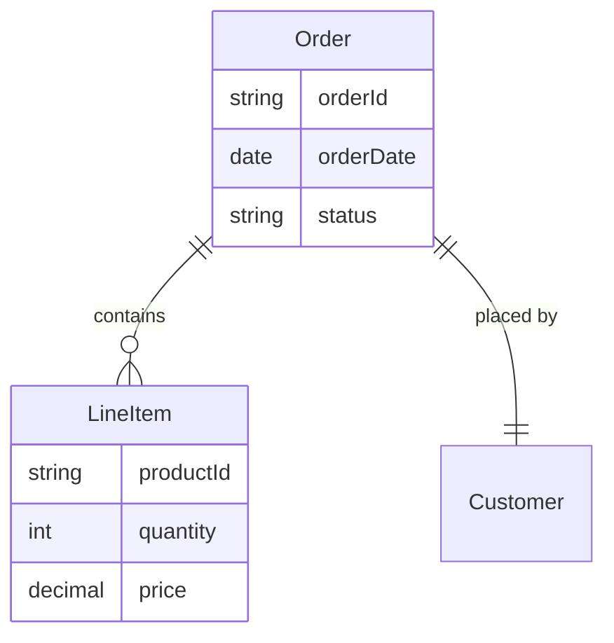

# Bounded Context Concept Map Generator

## Purpose
Generate visual ER diagrams and concept maps that show relationships between domain entities, with support for ubiquitous language documentation.

## When to Use
- User asks to create a concept map for a domain model
- User wants to visualize entities and relationships in a bounded context
- User requests a domain model diagram or ER diagram
- User wants to document ubiquitous language with visual models
- User is doing Domain-Driven Design (DDD) and needs to model aggregates, entities, and relationships

## Instructions

1. **Gather information**: Ask the user about the domain entities, their attributes, and relationships
2. **Identify relationships**: Determine how entities connect (inheritance, composition, association, etc.)
3. **Generate ER diagram**: Use the Python script to create a Mermaid ER diagram
4. **Include ubiquitous language**: Document entity descriptions as part of the output
5. **Explain structure**: Briefly explain the relationships and domain model

### Advanced Patterns

For advanced concept mapping patterns and techniques, see [references/advances_patterns.md](references/advances_patterns.md).

### Using the Generation Script

To generate concept maps programmatically, use the Python script:

```bash
python scripts/generate_concept_map.py
```

## Output Format

Use Mermaid ER diagrams for domain models:



The output includes:
- ER diagram with entities and relationships
- Relationship Syntax Legend
- Ubiquitous Language definitions
- Usage instructions

## Examples

When user says: "Create a concept map for an order management system"
- Identify entities: Order, LineItem, Customer, Product
- Define relationships: Order contains LineItems, Order placed by Customer
- Show attributes for each entity
- Document ubiquitous language definitions
- Generate Mermaid ER diagram
