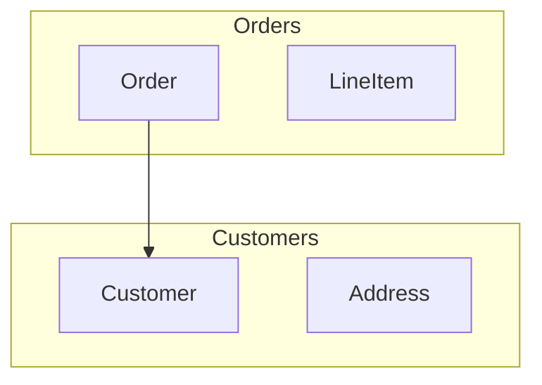

# Advanced Patterns and Customization

This reference provides advanced patterns for creating concept maps and customizing the generator.

## Complex Relationship Patterns

### Multi-Cardinality Relationships

```
1- Order; A customer purchase
* Can contain 1..* `LineItems`
* Is placed by exactly 1 `Customer`
* Can have 0..1 `Discount`
```

### Bidirectional Relationships

```
1- Student; A person enrolled in courses
* Is enrolled in 1 or more `Courses`

2- Course; A class offering
* Has 1 or more `Students` enrolled
```

### Aggregation vs Composition

Use "has" for composition (lifecycle dependent):
```
1- Order; 
* Has `LineItems` (destroyed when order is deleted)
```

Use "associated with" for aggregation (independent lifecycle):
```
1- Course;
* Associated with 1 or more `Students` (students exist independently)
```

## Concept Type Annotations

While the script infers types from context, you can explicitly mark concepts:

### Value Objects
Add "(value object)" in the description:
```
1- EmailAddress (value object); An email address string
```

### Aggregates
Add "(aggregate)" in the description:
```
1- Order (aggregate); The order aggregate root
```

## Custom Node Styling

The generator uses these styles by default. To customize, modify the `generate_mermaid()` method:

```python
# Entity (default)
style NodeId fill:#e8f5e9,stroke:#388e3c,stroke-width:2px

# Specialized Entity (inherits from another)
style NodeId fill:#e1f5ff,stroke:#0288d1,stroke-width:2px

# Value Object
style NodeId fill:#fff9c4,stroke:#f57f17,stroke-width:2px

# Aggregate
style NodeId fill:#f3e5f5,stroke:#7b1fa2,stroke-width:3px
```

## Parsing Customization

### Adding New Relationship Types

To support new relationship patterns, add to the `_parse_entry()` method:

```python
elif 'manages' in line.lower():
    manage_match = re.search(r'manages\s+(\d+)\s+`([^`]+)`', line, re.IGNORECASE)
    if manage_match:
        cardinality = manage_match.group(1)
        target = manage_match.group(2)
        concept.relationships.append((target, "manages", cardinality))
```

Then handle in `generate_mermaid()`:

```python
elif rel_type == "manages":
    lines.append(f'    {source_id} ==>|manages {cardinality}| {target_id}')
```

## Mermaid Graph Direction

The default is top-down (`graph TD`). To change:

- `graph LR` - Left to right
- `graph RL` - Right to left  
- `graph BT` - Bottom to top

Modify the first line in `generate_mermaid()`:

```python
lines = ["graph LR"]  # Change from TD to LR
```

## Handling Large Diagrams

For bounded contexts with many concepts:

1. **Split into subdomains** - Create separate diagrams for each subdomain
2. **Limit attributes** - The script shows max 3 attributes per node
3. **Use subgraphs** - Group related concepts:



## Domain-Driven Design Patterns

### Bounded Context Mapping

```
1- OrderContext (bounded context); Handles order processing
* Contains `Order` aggregate
* Contains `OrderItem` entity
* Published `OrderPlaced` event

2- InventoryContext (bounded context); Manages inventory
* Subscribes to `OrderPlaced` event
* Contains `Product` aggregate
```

### Event Sourcing

```
1- Order (aggregate);
* Publishes `OrderCreated` event
* Publishes `OrderShipped` event
* Publishes `OrderCancelled` event

2- OrderEvent (value object); Base event type
```

## Performance Tips

- **Large files**: For files with 50+ concepts, consider splitting into multiple diagrams
- **Relationship complexity**: Limit to 3-5 relationships per concept for readability
- **Attribute detail**: Keep attribute descriptions brief; detailed specs go in separate documentation
